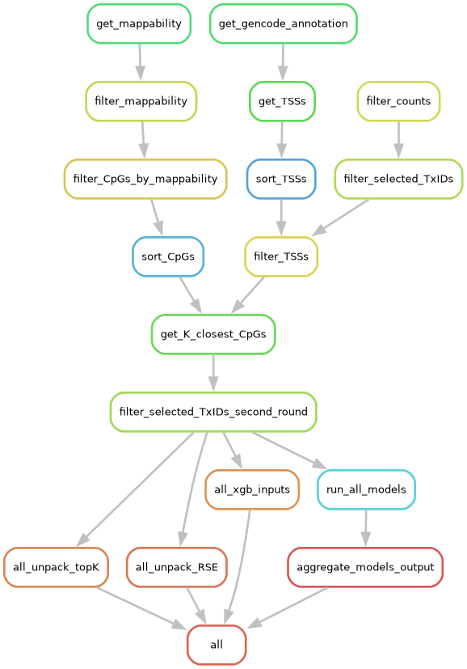

# GUS
A ML framework to predict gene expression and select CpGs from methylation data

How to use:

git clone https://github.com/AVitriolo/GUS.git
conda env create -f workflow/envs/snakemake\_env.yml
conda activate snakemake-env

snakemake \
--snakefile /home/Prostate\_GAS/workflow/Snakefile \
--configfile /home/Prostate\_GAS/config/config.yaml \
--use-conda \
--cores 100
